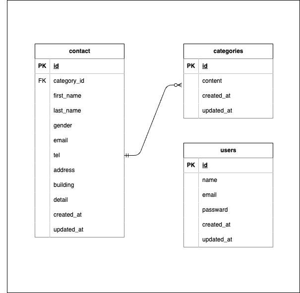

# アプリケーション名

- 確認テスト　お問い合わせフォーム

## 環境構築

**Dockerビルド**

- git clone git@github.com:NobuyoshiShimada/test_contact-form.git
- docker-compose up -d --build

**Laravel環境構築**

- composer install
- composer create-project "laravel/laravel=8.\*" . --prefer-dist
- cp .env.example .env 環境変数を適宜変更
- php artisan key:generate
- php artisan migrate
- php artisan db:seed

## 使用技術

- macOS Swquoia 15.6
- PHP: 8.1.34
- Laravel: 8.83.29
- MySQL 8.0.26
- nginx 1.21.1

## 開発環境

- お問い合わせ画面 : http://localhost/
- ユーザー登録 : http://localhost/register/
- phpMyAdmin : http://localhost:8080

## ER図

